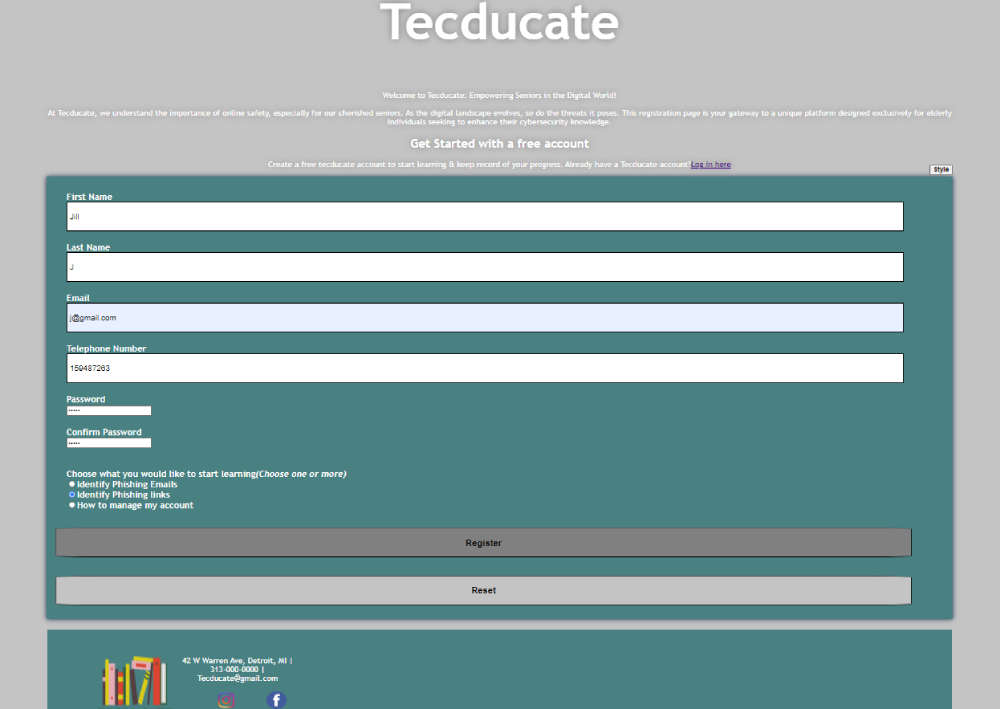

<h1> </h1>


<h2>Tecducate</h2>

<h3>Introduction: </h3>

The creation of this project was undertaken as part of the Software Engineering course at Wayne State University. At Tecducate, we understand the importance of online safety, especially for our cherished seniors. As the digital landscape evolves, so do the threats it poses. This registration page is your gateway to a unique platform designed exclusively for elderly individuals seeking to enhance their cybersecurity knowledge.

* [Review Requirements](https://github.com/WSU-4110/Tecducate/issues) · [See wiki page](https://github.com/WSU-4110/Tecducate/wiki)

    
<h3>Team members:</h3>

1. Maria Alsamaien (mariasam16)
2. Susmita Ghosh (Susmita-Rani-Ghosh)
3. Geovanni Tinoco (GeoT82)
4. Abdullahi (AbdullahiAyantayo)
5. Mohammad (mhazadegan)


<h2> Features </h2><p>
 
* Create an account using your first name, last name, email address, phone number, and password. Then, choose which lesson you would like to learn about.<br>
* log in <br>
* View Account information, Leaderboard, chosen lesson, and List of offered lessons. There is also a settings icon on the profile page.<br>
* Leaderboard: See how others are doing on their quizzes. <br>
* Clicking on the "Go to Lesson"  will then take the user to the chosen lesson. <br>
* After learning the material, users have the option to take a quiz and advance their proficiency level up to level 3.<br>
* From the settings page, users can update their profile, delete their profile, reset the lesson plan, or return to the profile page. <br>
* The "Update Profile" page can be used to update the user's first and last name, phone number, and password. <br>
* The "Delete Profile" button will delete the user's account and redirect them to the login page. <br>
* Reset lesson Plan will reset user proficiency level to 1. <br>
 
## Technologies
The project was created with
* [](https://www.eclipse.org/)
* [](https://www.mysql.com/)
* [](https://tomcat.apache.org/)


 <h3> Setup</h3>
 > * Download Eclipse <br>
 > * Set up Apache tomcat<br>
 > * Download JDK version 15<br>
 > * Import the project from github<br>
 > * Chamnge the path to JDK 15<br>
 > * Create Java Home and paste the JDK 15 directory path. <br>
 > * Create a new system environment variable called Catalina Home and paste tomcat directory path. <br>
 > * Install MySQL and create a root user
 > * Upload the tecduQuery.sql into the MySql. 
 > * Go to main/src/java and run the controlservelet.java

# Developers
#### FrontEnd: 
```
   Susmita Ghosh
   Maria
   Mohammad
   Geovanni Tinoco 
  ```
#### BackEnd
```
  Geovanni Tinoco 
  Abdullahi
  ```

## **Project status** : 
This project is no longer actively maintained. Feel free to fork it if you find it useful.

## Sources
* [krebsonsecurity](https://krebsonsecurity.com/)
* [The Hacker News](https://thehackernews.com/)
* [Stay Safe Online](https://staysafeonline.org/)
* [Federal Trade Commission - How to Recognize and Avoid Phishing Scams](https://consumer.ftc.gov/articles/how-recognize-and-avoid-phishing-scams)

## Screenshots

*Registration page*


*Invalid Credentials Illustration*


*Log In page*


*Profile page*

## [See Full Demo Here](Tecducate/src/main/webapp/Demo)
